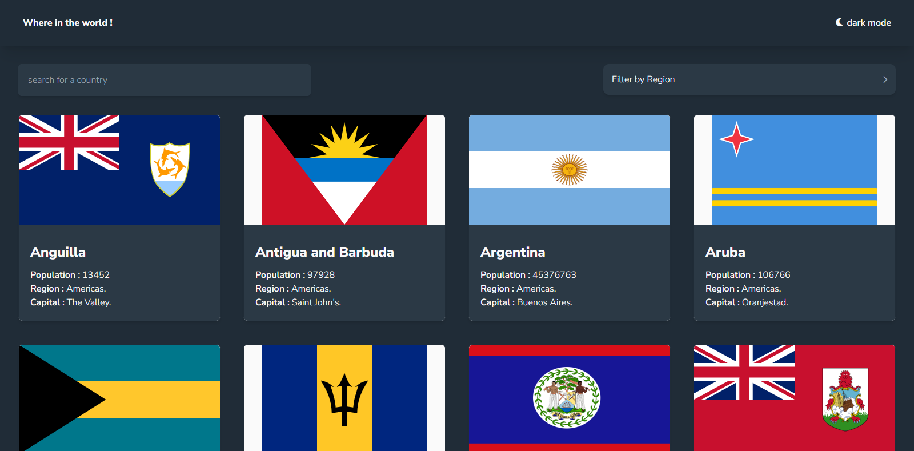

# Frontend Mentor - REST Countries API with color theme switcher solution

This is a solution to the [REST Countries API with color theme switcher challenge on Frontend Mentor](https://www.frontendmentor.io/challenges/rest-countries-api-with-color-theme-switcher-5cacc469fec04111f7b848ca). Frontend Mentor challenges help you improve your coding skills by building realistic projects. 

## Table of contents

- [Overview](#overview)
  - [The challenge](#the-challenge)
  - [Screenshot](#screenshot)
  - [Links](#links)
- [My process](#my-process)
  - [Built with](#built-with)
  - [What I learned](#what-i-learned)
- [Author](#author)
 

 
## Overview

### The challenge

Users should be able to:

- See all countries from the API on the homepage
- Search for a country using an `input` field (still not functioning)
- Filter countries by region
- Click on a country to see more detailed information on a separate page
- Click through to the border countries on the detail page
- Toggle the color scheme between light and dark mode  

### Screenshot

 
 
### Links

- Solution URL: [Add solution URL here](https://your-solution-url.com)
- Live Site URL: [Add live site URL here](https://your-live-site-url.com)

## My process

### Built with

- Semantic HTML5 markup
- Flexbox
- CSS Grid
- Mobile-first workflow
- Next.js (https://nextjs.org/) - React framework
- Tailwindcss(tailwindcss.com/docs/) - For styles

 
 
### What I learned

- Faster workflow 
- Grid managment  
- Redux is great ! 

 
## Author

- Website - [Aouragh mohammed el amine ](https://aouragh-dev.vercel.app/)
- Frontend Mentor - [@Aouragh Mohamed El Amine](https://www.frontendmentor.io/profile/AouraghMohamedElAmine)
- Twitter - [@Amin02941392](https://www.twitter.com/Amin02941392)

 